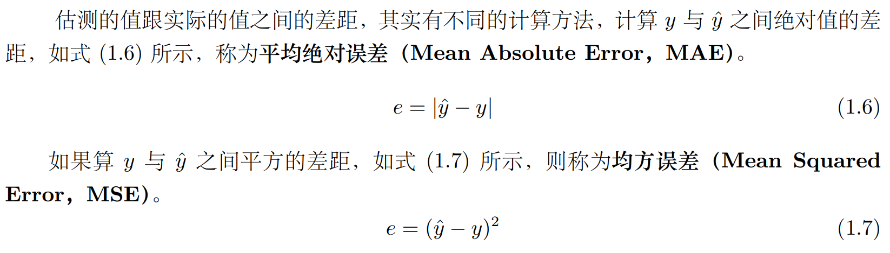
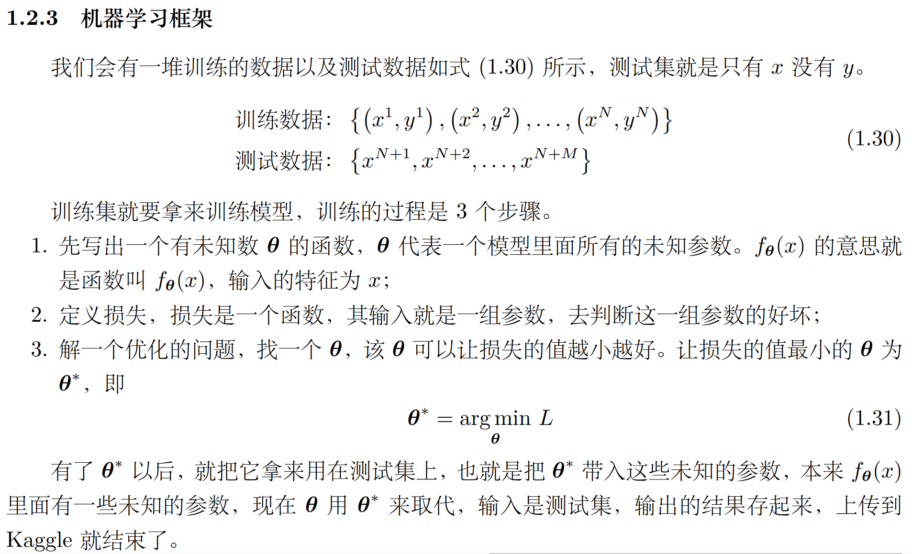
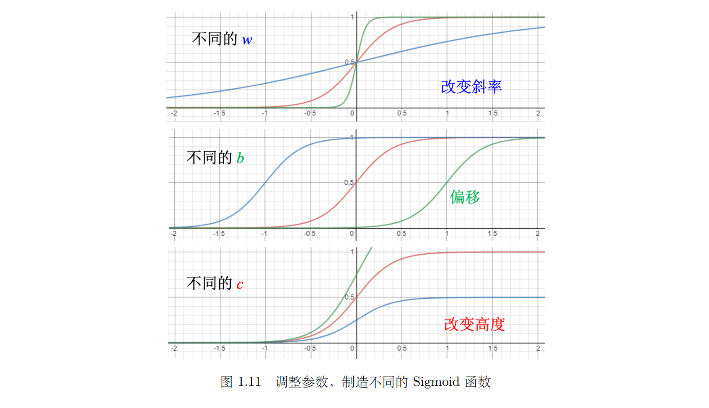
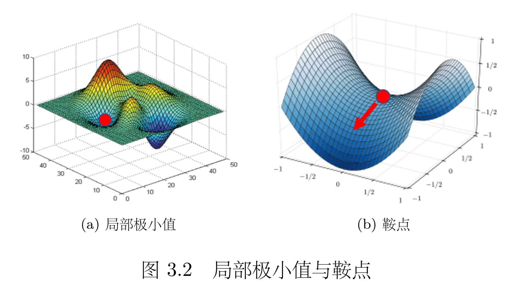
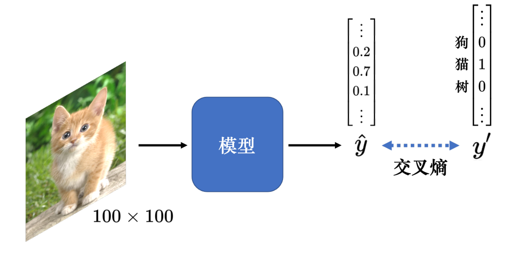
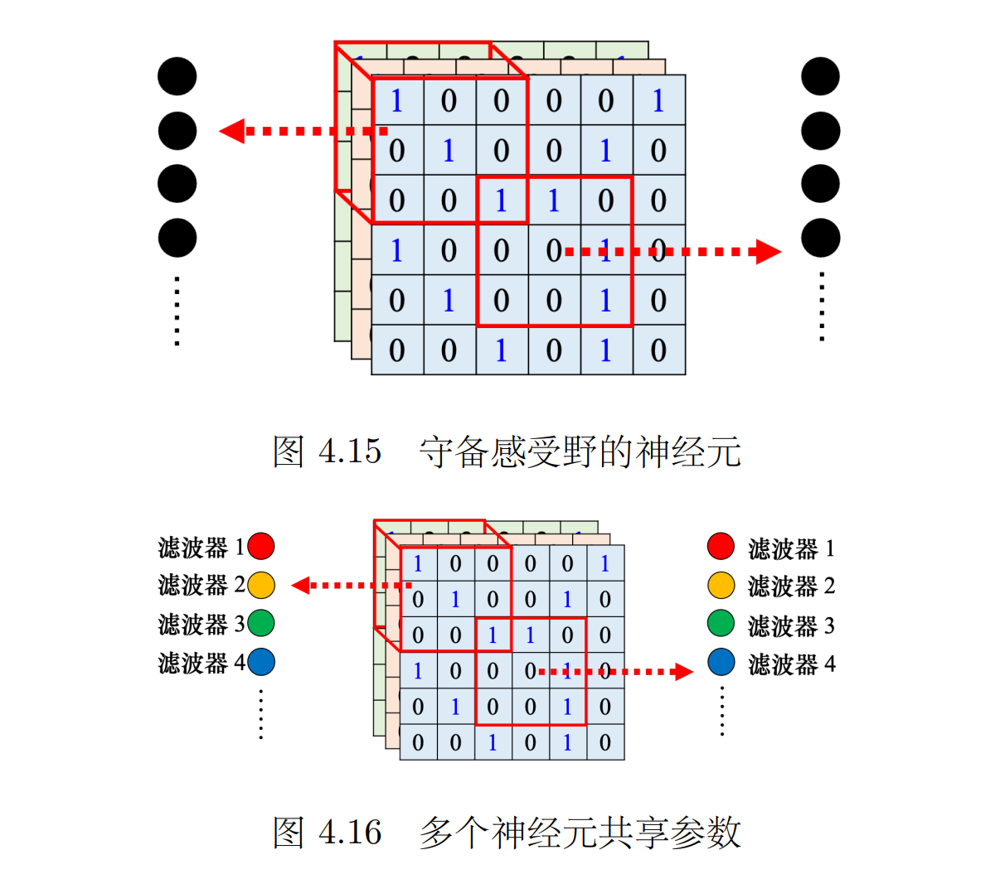
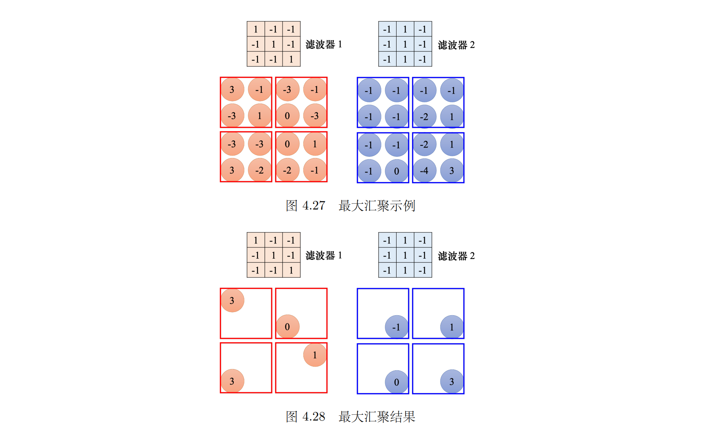
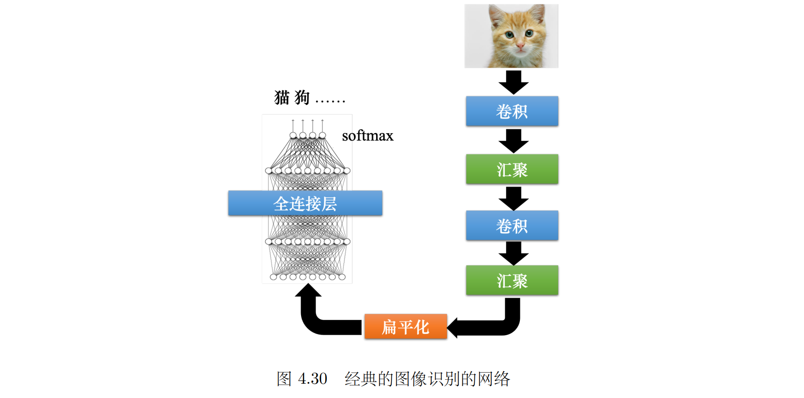
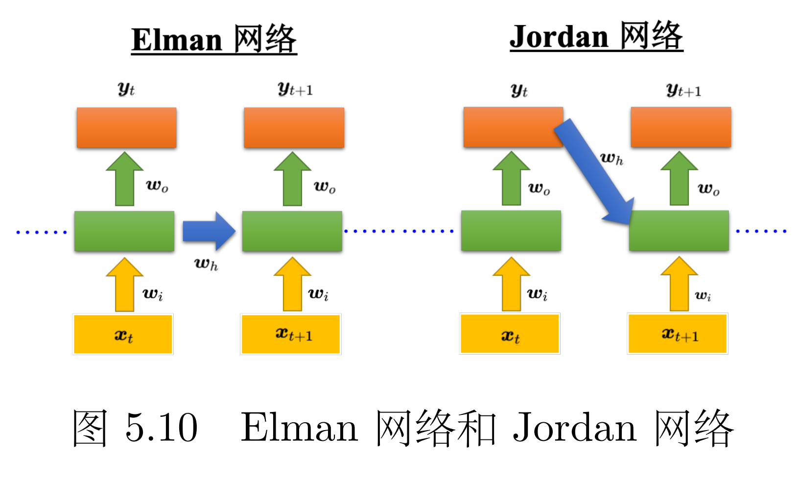
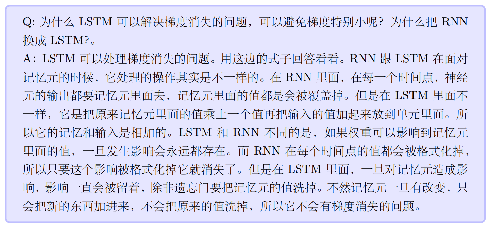

# 参考

> 李宏毅 深度学习教程：[LeeDL-Tutorial](https://github.com/datawhalechina/leedl-tutorial)

# Chapter 1

## 机器学习流程

1. 写出一个带有未知参数的函数: $y=b+w_1x$

2. **定义损失**用来衡量函数好坏

   1. 平均绝对误差

   2. 均方误差

      

3. **解最优化问题**，寻找最优的 $b, w_1$；**梯度下降**是常用的方法。

**梯度下降**：设定**学习率**，让机器自己找到最优参数的过程；可能只能找到局部最小值；可通过调整学习率来改善（但是调整了也未必能找到全局最小值）

**流程图**：

## 激活函数

**Sigmoid**：倒S型，可以通过调整 $b,w,c$ 得到不同的形状：
$$
y=c \frac {1+e^{-(b+wx_1)}}{1}
$$

**ReLU**: 开始是0，某位置之后变为非0的一次函数：$y=c \times \max(0,b+wx_1)$

## 名词定义总结

**超参数**：需要自己设定的参数（如学习率）

**神经元**：ReLU，Sigmoid都算

**隐藏层**：神经网络中每一排称为一个隐藏层

**过拟合**：训练数据和测试数据上的结果不一致

> 如在训练数据上，3层比4层差；但是在没看过的数据上，4层比较差，3层比较好

# Chapter 2

**解决过拟合**：1. 增加训练数据；2. 给模型增加限制，如规定其为二次函数

**交叉验证**：把训练的数据分成两半，一部分称为训练集（training set），一部分是验证集（validation set），如k折交叉验证、留一法验证等

# Chapter 3

## 临界点/鞍点

**临界点**：梯度为0的点统称为临界点。<u>梯度（损失关于参数的微分）</u>为0时，损失无法继续下降，此时既有可能收敛在了**局部极小值点**，也可能收敛在**鞍点**。

**鞍点**：梯度为0，但并不是**局部极小/大值点**的点：

**判断个临界点到底是局部极小值还是鞍点**：利用泰勒展开式，推导过程跳过

> 其他内容用不上，暂时跳过

# Chapter 4

## 将图像输入模型

**将图像输入模型**：分为3个通道（RGB），分别表明R, G, B在某一个通道下的颜色强度；如 $100 \times 100$的图像的输入向量长度为 $100 \times 100 \times 3$

**分类模型的输出**：独热向量，即分类结果的位是1，其他位是0；向量的长度代表了分类结果的数量：

## 感受野/卷积

> [!TIP]
>
> **观察 1**：检测模式不需要整张图像

**感受野**：根据观察1，卷积神经网络会设定一个区域，即**感受野（receptive field）**，每个神经元都只关心自己的感受野里面发生的事情，<u>感受野是由我们自己决定的</u>。

- 感受野可以相连
- 感受野可以只考虑部分通道（但一般来说都考虑全部通道，因为不会觉得有些模式只出现在某一个通道里面）
- **核大小**：高、宽，如 $3 \times 3$，深度就等于通道数，所以一般不额外描述
- 感受野超出图像范围时，需要进行**填充**，可以补0/采用其他填充方法
- 感受野盖满整个图像，保证所有位置都有神经元去监督

**步幅（stride）**：感受野上下左右移动的像素数，是一个**超参数**；$3 \times 3$的感受野情况下步幅一般为2，因为可以保证感受野重叠。

> **Q：为何要保证感受野重叠？**
>
> A：假设感受野完全没有重叠，如果有一个模式正好出现在两个感受野的交界上面， 就没有任何神经元去检测它，这个模式可能会丢失，所以希望感受野彼此之间有高度 的重叠。如令步幅 = 2，感受野就会重叠。

> [!TIP]
>
> **观察 2**：同样的模式可能会出现在图像的不同区域

**简化方法**：对不同的感受野采用相同的参数，也就是**参数共享（parameter sharing**），所以每个感受野都只有一组参数，这些参数称为**滤波器/卷积核（filter）**

> 因为输入不一样，所以就算是两个神经元共用参数，它们的输出也不会是一样的

**卷积层**：感受野+参数共享（都是为图像识别设计的）；用到卷积层的网络叫**卷积神经网络**。共享权重其实就是用滤波器扫过一张图像，这个过程就是卷积。

> [!TIP]
>
> **观察 3**：下采样不影响模式检测

**下采样**：去掉图像的偶数行/奇数列，图像的模式不会发生改变，但大小变为原来的1/4

**汇聚**：将图像变小，不会改变图像的通道数；有多种汇聚方法，如最大汇聚、平均汇聚；可以减小图像以降低计算量，但会对模型性能造成损失；之前可能会几次卷积后进行一次汇聚，目前越来越多的模型逐渐取消了汇聚，因为算力不断增强：

**扁平化**：将矩阵形状的矩阵排布为一个一维向量；全连接层负责分类任务

**设计卷积神经网络的典型例子**：AlphaGo

1. 将棋盘看作一个 $19 \times 19$ 大小的图像，图像有48个通道（围棋高手设计的）
2. 不使用汇聚，因为对于棋盘来说汇聚会改变棋盘信息
3. 使用了192个卷积核（尝试得到的结果，此时效果最好）

> [!NOTE]
>
> 卷积神经网络**不能处理图像放大缩小或者是旋转的问题**，因此在做图像识别的时候往往都要做数据增强。所谓数据增强就是把训练数据每张图像里面截一小块出来放大，让卷积神经网络看过不同大小的模式；把图像旋转，让它看过某一个物体旋转以后长什么样子，卷积神经网络才会做到好的结果。卷积神经网络不能够处理缩放（scaling）跟旋转（rotation）的问题，但 Spatial Transformer Layer 网络架构可以处理这个问题。

# Chapter 5

## RNN

**记忆元**:

1. 每一次隐藏层的神经元产生输出的时候，该输出会被存到记忆元（memory cell）
2. 下一次有输入时，这些神经元不仅会考虑输入 $x_1,x_2$ ， 还会考虑存到记忆元里的值
3. 所以记忆元也会影响到输出结果
4. 记忆元可简称为**单元（cell）**；记忆元的值也可称为**隐状态（hidden state）**

> 隐状态的计算是循环的（recurrent），基于循环计算的隐状态神经网络被称为**循环神经网络(RNN)**

**Elman 网络 & Jordan 网络**

- **Elman 网络（简单循环网络）**：将隐藏层的输出存到记忆元，在下一个时刻输入到下一层
- Jordan网络：把输出值在下一个时间点在读 进来，把输出存到记忆元里
- 

## 长短期记忆网络（LSTM）

**LSTM**

1. 长时间的<u>短期</u>记忆
2. **输入门**：决定何时将输入存入记忆元
3. **输出门**：决定外界其他的神经元能否从这个记忆元里面把值读出来
4. **遗忘门**：决定什么时候记忆元要把过去记得的东西忘掉

**梯度消失与梯度爆炸**

- **隐患**：*梯度消失会导致我们的神经网络中前面层的网络权重无法得到更新，也就停止了学习；梯度爆炸会使得学习不稳定， 参数变化太大导致无法获取最优参数*
- **解决办法**：
  - 调整学习率很难解决
  - 一种解决办法是**裁剪（clipping）**，即当梯度大于某一个阈值的时候，不要让它超过那个阈值
  - LSTM可以解决梯度消失问题，但无法解决梯度爆炸问题
- 为何LSTM能解决梯度消失问题？
  - 参考：[RNN 的梯度消失问题-知乎](https://zhuanlan.zhihu.com/p/44163528)
  - 

