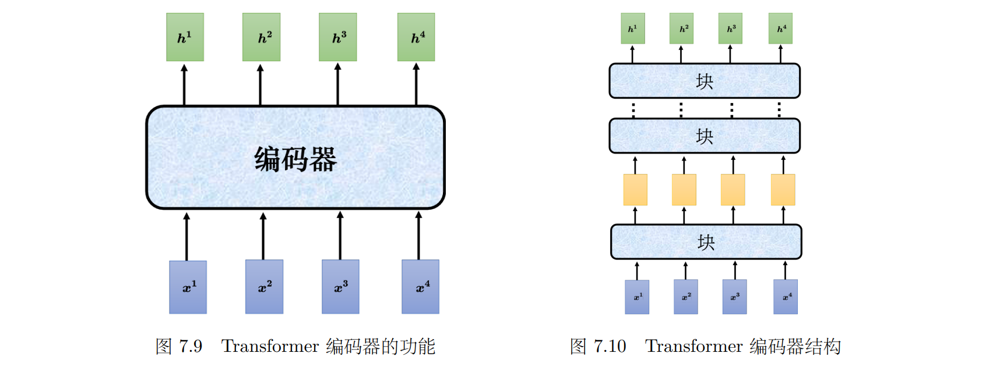

# 参考

> 李宏毅 深度学习教程：[LeeDL-Tutorial](https://github.com/datawhalechina/leedl-tutorial)

# Chapter 6

## **输入是向量序列**

- **文字处理**：输入一个句子，每个词汇都是一个向量
  - 词汇用**独热编码**表示：无法获知词汇之间的关联
  - 词汇用**词嵌入**表示：向量包含语义信息
- **语音输入**：
  - 把一段声音信号取一个范围，这个范围叫做一个**窗口（window）**，把该窗口里面的信息描述成一个向量，这个向量称为**一帧（frame）**
  - 通常来说窗口的长度是 25 毫秒，窗口移动的大小是 10 毫秒（经验得到的结果）

> [!TIP]
>
> *考虑以下三种类型*：
>
> **类型 1：输入与输出数量相同**：词性标注，给一段话，分析每个词汇的词性
>
> **类型 2：输入是一个序列，输出是一个标签**：情感分析，给一段话分析其情感
>
> **类型 3：序列到序列**：翻译任务

## 自注意力

> [!NOTE]
>
> **背景**：全连接网络+Softmax(归一化函数，将全连接网络的输出向量转化为概率分布)适合进行分类，但无法考虑到上下文信息：
> $$
> Softmax(z_i)=\frac{e^{z_i}}{\sum_{j=1}^Ke^{z_j}}
> $$

### **自注意力模型**

**运作方式**

**向量 $b_1$ 的产生过程**

- 根据 $a_1$ 找出输入序列里面跟 $a_1$ 相关的其他向量
- 每一个向量跟 $a_1$ 的关联的程度可以用数值 $\alpha$ 来表示
- **关联程度 $\alpha$ 的计算方法**：点积/相加；*Transformer中使用的是**点积***
- **点积**：
  - 输入的两个向量分别乘上两个不同的矩阵：$W_q,W_k$，得到向量 $q,k$
  - 将 $q,k$ 做<u>点积（逐元素相乘再相加）</u>得到关联程度 $\alpha$

- 

**计算向量之间的关联性**

1. 利用 $q,k$ 向量的点积计算：

2. 计算后通过 $Softmax$ 进行归一化操作（也可以选择其他激活函数）

   

3. 通过 $Softmax$ 计算得到 $\alpha_{1,i}'$ ，之后乘 $W_v$ 得到新的向量 $v^i$ ，并通过下列计算得到 $b^i$ ；所以*谁的注意力的分数（$\alpha$）最大，谁的 $v$ 就会主导（dominant）抽出来的结果*：
   $$
   b^1=\sum _i \alpha _{1,i}' v^i
   $$
   

> [!TIP]
>
> 可以利用**矩阵乘法**计算注意力分数等，具体推导略过：
>
> 

### **多头自注意力（multi-head self-attention）**

用多个不同的 $q$ 表示不同类别的相关性，相对应地也有多个不同的 $k,v$ ；头的数量是一个**超参数**，相关性的计算方法相同：

### 位置编码/截断自注意力

**位置编码**

- 位置信息同样重要，如词性分析中第一个词是动词的概率较小
- 位置编码为每一个位置设定一个位置向量 $e^i$ ，输入时将其加到 $a^i$ 上，相当于告诉模型：如果看到 $a^i$ 被加上 $e^i$ ，它就知道现在出现的位置应该是在 $i$ 这个位置
- 产生位置向量的方法：人为设定/**正弦余弦函数**（Transformer中的方法）/其他

**截断自注意力**

- 计算注意力矩阵时，复杂度是长度的平方，导致数据量增大时需要大量内存、计算资源
- 人为设定模型看某句话的范围，减少计算量，加快运算速度

# Chapter 7

## Transformer结构

包含**编码器、解码器**：

### 编码器

- 编码器包含很多块，每个块都是输入一排向量，输出一排向量，最后一个块的输出作为最终的向量序列

  

- 每个块并不是神经网络的一层，包含了**自注意力**、**全连接层**以及**残差连接**设计：

  

> [!NOTE]
>
> **残差连接**
>
> - $y=\mathbb{F}(x)+x$
> - 用于缓解深层网络中的梯度消失和退化问题
> - 使得更深的网络能够训练

- Tranformer中块重复N次：

  

### 解码器

# Chapter 8

## 生成式对抗网络（GAN）

**生成式对抗网络（generative adversarial network）**

- 在输入中加入随机数 $z$
- **无限制生成**（unconditional generation）：直接输入随机数 $z$
- 限制生成（conditional generation）：需要原始输入 $x$，如 $x,z$ 长度相同是将二者相加作为整体输入

**生成器/辨别器**

- 生成器如上，可采用多种分布采样（高斯分布，二项分布等）

- 辨别器与生成器相同，通常是一个神经网络

  > 以生成图像为例，辨别器可以采用CNN

- **训练步骤**：固定生成器训练判别器、固定判别器训练生成器

> [!IMPORTANT]
>
> 训练具体数学运算用不上，略

## 条件型生成

1. 可以使用Transformer读入文字条件，之后根据条件去生成正确内容
2. 在**判别器**中，需要输入成对的数据来训练判别器
3. 对于生成结果 $y$ 和条件 $x$ 关联小的生成结果，判别器给予低分

**循环生成对抗网络（Cycle GAN）**

- 适用于没有成对输入用于训练的情况（如给人物真实图片，想要生成其动漫风格的人物图片）

- **训练过程**

  - 两个生成器、一个判别器

  - 增加一个额外的目标，就是我们<u>希望输入一张图片，其从 $x$ 域转成 $y$ 域以后，要从 $ y $ 域转回原来一模一样的 $x$​ 域的图片</u>

    > 所以叫**循环**生成对抗网络

    

# Chapter 9

## 扩散模型

**生成过程**

1. 生成一张全部是噪声的图片
2. 经过 $N$ 部去噪过程，最终得到想要的图片
3. 通常会给每一个去噪的步骤一个编号，*产生最终图片的那个编号比较小*
4. 去噪模型的每一步除了输入当前图片以外，还要**输入当前步骤数**以表示当前噪声的严重程度
5. 去噪的模组里面有一个**噪声预测器**，用于预测图像中的噪声，之后利用生成的噪声图像；输出就直接是去噪后的图片，它其实是<u>产生一个这个输入的图片的噪声，再把噪声扣掉输入的图片来达到去噪的效果</u>

​	

## 训练噪声预测器

1. 从数据集中拿出一张图像

2. 高斯采样在图像上不断加噪声

   > 加噪音的过程称为前向过程，也称为**扩散过程**

3. 最终将**加噪声的图片结果**与**加噪声轮数**作为一堆输入用于训练预测器

   
