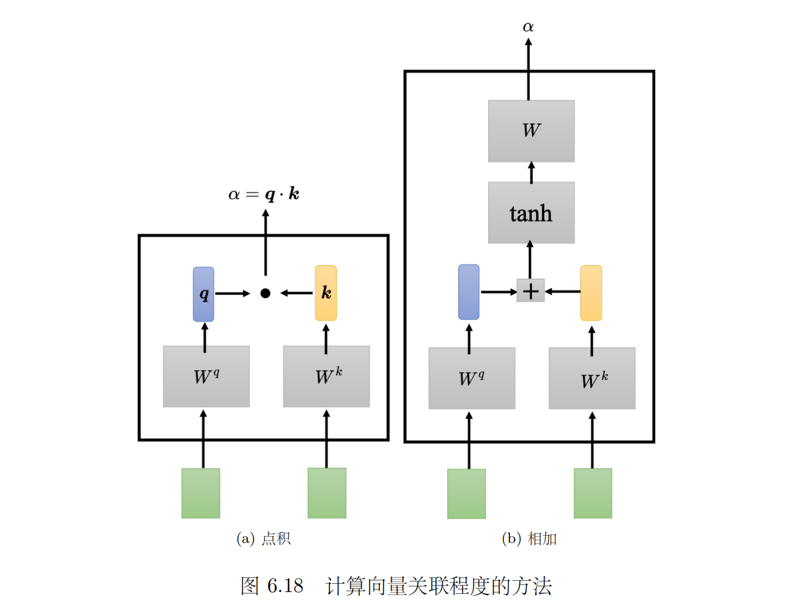

# 参考

> 李宏毅 深度学习教程：[LeeDL-Tutorial](https://github.com/datawhalechina/leedl-tutorial)

# Chapter 6

## **输入是向量序列**

- **文字处理**：输入一个句子，每个词汇都是一个向量
  - 词汇用**独热编码**表示：无法获知词汇之间的关联
  - 词汇用**词嵌入**表示：向量包含语义信息
- **语音输入**：
  - 把一段声音信号取一个范围，这个范围叫做一个**窗口（window）**，把该窗口里面的信息描述成一个向量，这个向量称为**一帧（frame）**
  - 通常来说窗口的长度是 25 毫秒，窗口移动的大小是 10 毫秒（经验得到的结果）

> [!TIP]
>
> *考虑以下三种类型*：
>
> **类型 1：输入与输出数量相同**：词性标注，给一段话，分析每个词汇的词性
>
> **类型 2：输入是一个序列，输出是一个标签**：情感分析，给一段话分析其情感
>
> **类型 3：序列到序列**：翻译任务

## 自注意力

> [!NOTE]
>
> **背景**：全连接网络+Softmax(归一化函数，将全连接网络的输出向量转化为概率分布)适合进行分类，但无法考虑到上下文信息：
> $$
> Softmax(z_i)=\frac{e^{z_i}}{\sum_{j=1}^Ke^{z_j}}
> $$

### **自注意力模型**

**运作方式**

**向量 $b_1$ 的产生过程**

- 根据 $a_1$ 找出输入序列里面跟 $a_1$ 相关的其他向量
- 每一个向量跟 $a_1$ 的关联的程度可以用数值 $\alpha$ 来表示
- **关联程度 $\alpha$ 的计算方法**：点积/相加；*Transformer中使用的是**点积***
- **点积**：
  - 输入的两个向量分别乘上两个不同的矩阵：$W_q,W_k$，得到向量 $q,k$
  - 将 $q,k$ 做<u>点积（逐元素相乘再相加）</u>得到关联程度 $\alpha$

- 

**计算向量之间的关联性**

1. 利用 $q,k$ 向量的点积计算：

2. 计算后通过 $Softmax$ 进行归一化操作（也可以选择其他激活函数）

   

3. 通过 $Softmax$ 计算得到 $\alpha_{1,i}'$ ，之后乘 $W_v$ 得到新的向量 $v^i$ ，并通过下列计算得到 $b^i$ ；所以*谁的注意力的分数（$\alpha$）最大，谁的 $v$ 就会主导（dominant）抽出来的结果*：
   $$
   b^1=\sum _i \alpha _{1,i}' v^i
   $$
   

> [!TIP]
>
> 可以利用**矩阵乘法**计算注意力分数等，具体推导略过：
>
> 

### **多头自注意力（multi-head self-attention）**

用多个不同的 $q$ 表示不同类别的相关性，相对应地也有多个不同的 $k,v$ ；头的数量是一个**超参数**，相关性的计算方法相同：

### 位置编码/截断自注意力

**位置编码**

- 位置信息同样重要，如词性分析中第一个词是动词的概率较小
- 位置编码为每一个位置设定一个位置向量 $e^i$ ，输入时将其加到 $a^i$ 上，相当于告诉模型：如果看到 $a^i$ 被加上 $e^i$ ，它就知道现在出现的位置应该是在 $i$ 这个位置
- 产生位置向量的方法：人为设定/**正弦余弦函数**（Transformer中的方法）/其他

**截断自注意力**

- 计算注意力矩阵时，复杂度是长度的平方，导致数据量增大时需要大量内存、计算资源
- 人为设定模型看某句话的范围，减少计算量，加快运算速度

# Chapter 7

